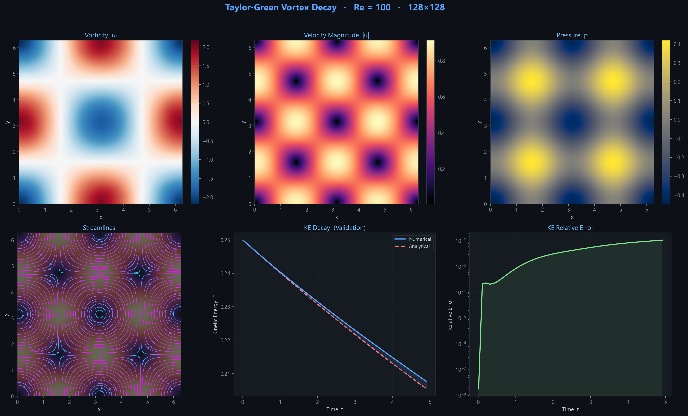
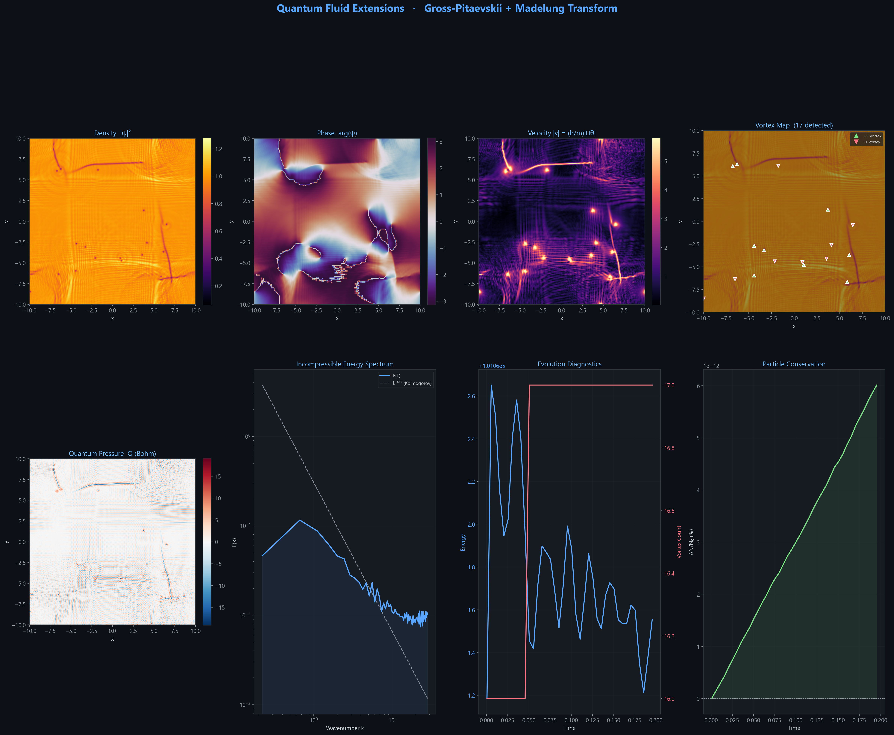
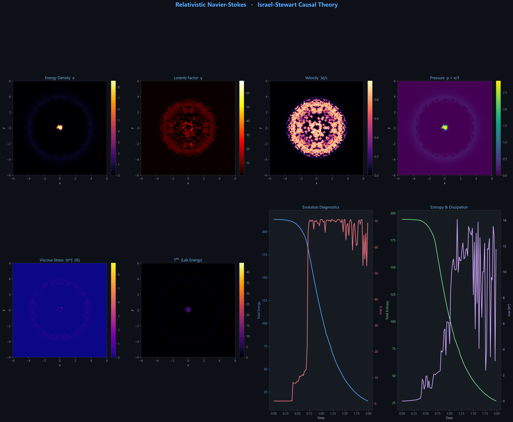
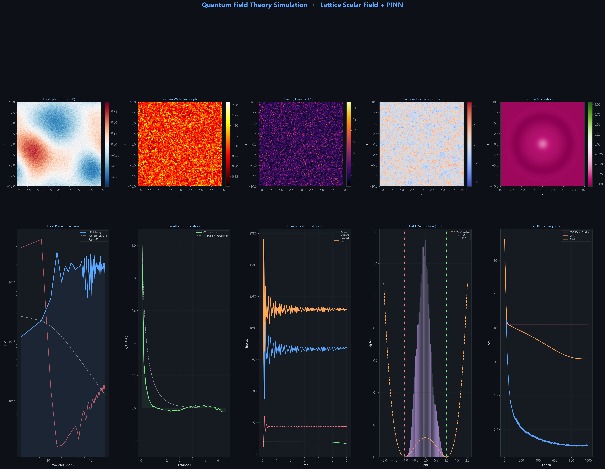
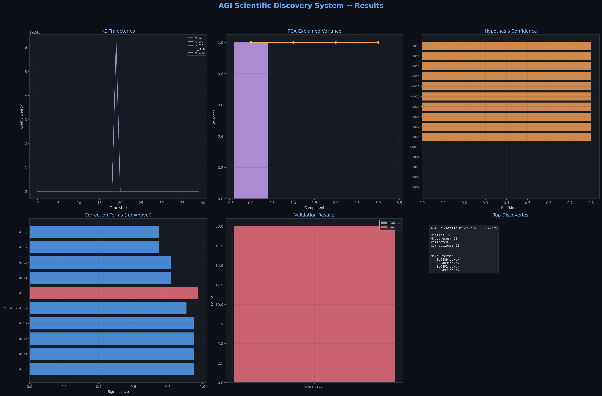
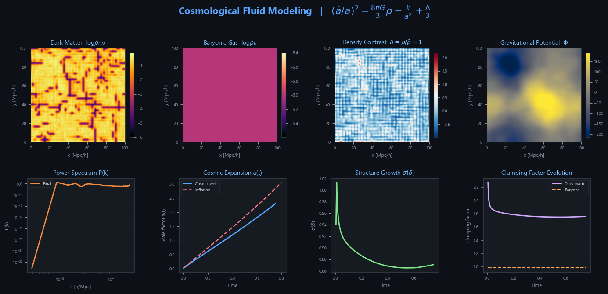
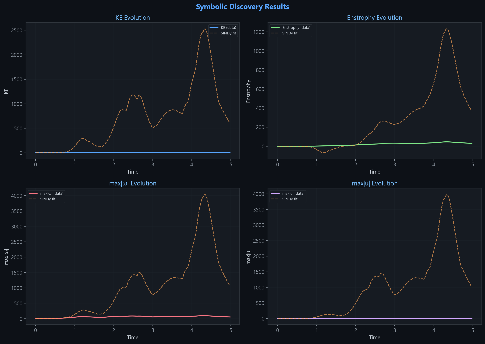
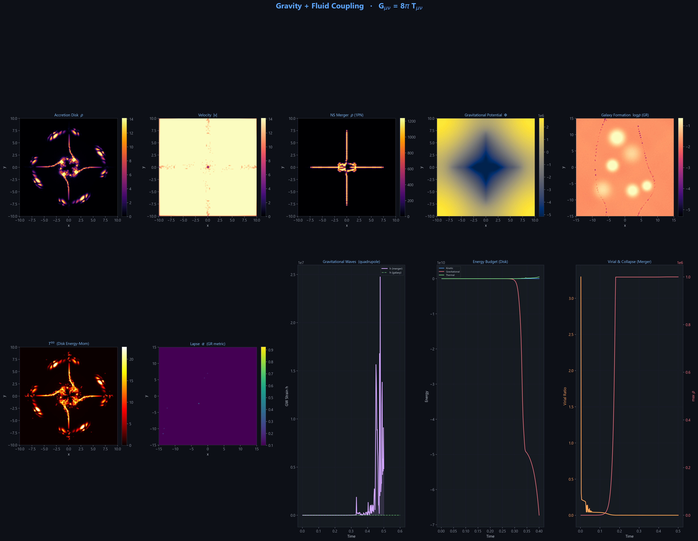

<p align="center">
  
  
  
  
  
</p>

<h1 align="center">
  🌊 Navier-Stokes Research Platform
</h1>

<p align="center">
  <b>Research-Grade Computational Fluid Dynamics · Deep Learning · Scientific Discovery</b><br>
  <code>∂u/∂t + (u·∇)u = −∇p + ν∇²u + f</code>
</p>

<p align="center">
  <i>A unified platform spanning classical fluids to cosmological structure formation —<br>
  integrating high-fidelity CFD solvers, neural surrogates, and autonomous equation discovery.</i>
</p>

---

## 🔭 Overview

This is a production-ready, research-grade simulation platform that unifies **10 physics domains**, **6 deep learning architectures**, and an **autonomous scientific discovery engine** under a single CLI. It bridges the gap between classical computational fluid dynamics and modern AI-driven physics research.

**What makes this different:**

- 🧮 **Classical CFD** — Projection-method NS solvers with FFT/Jacobi/SOR/CG pressure solvers, WENO-5 advection, and DNS/LES/RANS turbulence models
- 🧠 **Neural Surrogates** — PINN, FNO, DeepONet, U-Net with attention gates — up to 1000× faster than CFD at inference
- 🔬 **Discovery AI** — Autoencoder + Neural ODE + SINDy + Genetic Programming pipeline that *discovers governing equations from data*
- 🤖 **AGI Orchestration** — Fully autonomous hypothesis → simulation → validation → knowledge-base loop
- 🌌 **Beyond Fluids** — Relativistic viscous hydrodynamics, quantum field theory on the lattice, cosmological N-body + Euler solvers, gravity-fluid coupling via Einstein equations

---

## ✨ Feature Matrix

| Domain | Capabilities |
|--------|-------------|
| **CFD Engine** | 2D/3D incompressible NS, projection method, FFT/Jacobi/SOR/CG pressure, central/upwind/WENO-5 advection |
| **Turbulence** | DNS, Smagorinsky LES, Dynamic Smagorinsky, k-ε RANS, k-ω SST, vorticity confinement |
| **ML Models** | PINN (physics-informed), FNO (Fourier operator), DeepONet (operator network), U-Net Surrogate (attention-gated) |
| **Discovery AI** | Convolutional Autoencoder, Neural ODE (latent dynamics), SINDy (sparse regression), Genetic Programming |
| **Regularity** | Blow-up detection CNN, BKM criterion, enstrophy budget, empirical regularity maps |
| **AGI Engine** | Physics Discovery, Hypothesis Engine, Knowledge Base, autonomous scientific workflow |
| **Visualization** | Real-time 2D (Pygame), 3D (PyVista/Matplotlib), Streamlit dashboard (Plotly), publication-quality plots |
| **Training** | AMP, cosine annealing + warmup LR, gradient clipping, checkpointing, curriculum learning |

---

## 🔬 Physics Domains

<table>
  <tr>
    <td width="50%">

### 1. Classical Fluid Dynamics
Incompressible Navier-Stokes with the projection method. Taylor-Green vortex, double shear layer, lid-driven cavity, channel flow.

### 2. Magnetohydrodynamics (MHD)
Coupled NS + Maxwell equations with Lorentz force and magnetic induction. Orszag-Tang vortex benchmark.

### 3. Astrophysics
Self-gravitating flows with radiative cooling. Rayleigh-Taylor instability and stellar dynamics.

### 4. Biophysics (Hemodynamics)
Pulsatile blood flow with non-Newtonian Carreau-Yasuda viscosity, stenosis geometry, wall shear stress.

### 5. Climate & Ocean
Geophysical flows with Coriolis force, thermal stratification, Ekman layers. Kelvin-Helmholtz instability.

  </td>
  <td width="50%">

### 6. Quantum Fluids (BEC)
Gross-Pitaevskii equation via split-step Fourier. Madelung transform, quantized vortices, quantum turbulence.

### 7. Relativistic NS (Israel-Stewart)
Causal viscous relativistic hydrodynamics. Bjorken flow, QGP fireballs, energy-momentum tensor evolution.

### 8. Quantum Field Theory
Lattice Klein-Gordon dynamics, Higgs-like symmetry breaking, FieldPINN for continuous spacetime learning.

### 9. Gravity-Fluid Coupling
Einstein field equations coupled with fluid dynamics. Gravitational wave–fluid interaction.

### 10. Cosmological Fluids
Friedmann equation-coupled N-body/Euler solver. Dark matter flow, baryonic structure formation, cosmic web evolution.

  </td>
  </tr>
</table>

---

## 📸 Gallery

<table>
  <tr>
    <td align="center">
      <br>
      <sub><b>Taylor-Green Vortex Decay</b></sub>
    </td>
    <td align="center">
      <br>
      <sub><b>Quantum Fluid Extensions (GPE)</b></sub>
    </td>
  </tr>
  <tr>
    <td align="center">
      <br>
      <sub><b>Relativistic NS — QGP Fireball</b></sub>
    </td>
    <td align="center">
      <br>
      <sub><b>Quantum Field Theory Simulation</b></sub>
    </td>
  </tr>
  <tr>
    <td align="center">
      <br>
      <sub><b>AGI Scientific Discovery</b></sub>
    </td>
    <td align="center">
      <br>
      <sub><b>Cosmological Fluid Modeling</b></sub>
    </td>
  </tr>
  <tr>
    <td align="center">
      <br>
      <sub><b>Symbolic Equation Discovery</b></sub>
    </td>
    <td align="center">
      <br>
      <sub><b>Gravity-Fluid Coupling</b></sub>
    </td>
  </tr>
</table>

---

## 🚀 Quick Start

### 1. Install Dependencies

```bash
pip install -r requirements.txt
```

> **Minimum:** `numpy`, `scipy`, `matplotlib`
> **Full stack:** add `torch`, `pygame`, `pyvista`, `streamlit`, `plotly`

### 2. Launch Interactive Menu

```bash
python main.py
```

This opens a 29-mode interactive menu covering demos, training, physics simulations, discovery AI, and more.

### 3. CLI Reference

```bash
# ── Core Demos ──────────────────────────────────────────────
python main.py --demo                  # Taylor-Green vortex benchmark
python main.py --demo --no-gui         # Headless (save plots only)
python main.py --viz2d                 # Real-time 2D visualizer (Pygame)
python main.py --viz3d                 # 3D visualizer (PyVista/Matplotlib)
python main.py --dashboard             # Streamlit web dashboard
python main.py --benchmark             # CFD solver benchmarks
python main.py --hybrid                # Hybrid CFD → PINN demo
python main.py --gpu                   # GPU-accelerated solver
python main.py --vort-conf 5.0         # Vorticity confinement demo

# ── ML Model Training ──────────────────────────────────────
python main.py --train pinn            # Physics-Informed Neural Network
python main.py --train fno             # Fourier Neural Operator
python main.py --train deeponet        # Deep Operator Network
python main.py --train surrogate       # U-Net Surrogate

# ── Physics Simulations ────────────────────────────────────
python main.py --physics mhd           # Magnetohydrodynamics
python main.py --physics astro         # Astrophysical flows
python main.py --physics bio           # Blood flow (hemodynamics)
python main.py --physics climate       # Geophysical / climate flows
python main.py --physics quantum       # Quantum fluids (BEC)
python main.py --physics relativistic  # Relativistic NS (Israel-Stewart)
python main.py --physics qft           # Quantum Field Theory
python main.py --physics gravity       # Gravity-fluid coupling
python main.py --physics cosmology     # Cosmological fluid modeling

# ── Discovery AI ───────────────────────────────────────────
python main.py --discover              # Full Turbulence Discovery pipeline
python main.py --symbolic              # SINDy + GP equation discovery
python main.py --stability             # Blow-up detection & stability
python main.py --regularity            # Empirical regularity map (Re sweep)
python main.py --metrics               # DNS vs LES turbulence metrics

# ── Quantum & Extensions ──────────────────────────────────
python main.py --quantum-ext           # GPE + Madelung + split-step Fourier
python main.py --relativistic          # Israel-Stewart causal viscous hydro
python main.py --qft                   # Lattice QFT + FieldPINN
python main.py --gravity-coupling      # Einstein equations + fluid
python main.py --cosmology             # Friedmann + N-body + cosmic web

# ── AGI Scientific Discovery ─────────────────────────────
python main.py --agi                   # Full autonomous discovery system
python main.py --physics-discover      # Physics-aware equation discovery
```

> **Tip:** Append `--no-gui` to any command to run headless and save plots to `images/`.

---

## 📂 Project Structure

```
Navier-Stokes/
├── main.py                        # Master CLI + interactive menu (29 modes)
├── config.py                      # Global configuration & hyperparameters
├── requirements.txt               # Python dependencies
│
├── core/                          # Classical CFD engine
│   ├── fluid_solver_2d.py         #   2D incompressible NS (projection method)
│   ├── fluid_solver_3d.py         #   3D incompressible NS
│   ├── pressure_solver.py         #   FFT, Jacobi, SOR, CG, Multigrid
│   ├── discretization.py          #   Finite difference (central, upwind, WENO-5)
│   ├── boundary_conditions.py     #   Dirichlet, Neumann, periodic, no-slip
│   └── turbulence_models.py       #   Smagorinsky, Dynamic Smag, k-ε, k-ω
│
├── models/                        # Deep learning architectures
│   ├── pinn.py                    #   Physics-Informed Neural Network
│   ├── fno.py                     #   Fourier Neural Operator (2D)
│   ├── deeponet.py                #   Deep Operator Network
│   ├── surrogate.py               #   U-Net Surrogate + attention gates
│   ├── turbulence_nn.py           #   Neural turbulence closure
│   ├── autoencoder.py             #   Flow Autoencoder + Latent ODE
│   ├── symbolic_discovery.py      #   SINDy + Genetic Programming
│   ├── regularity_analysis.py     #   Blow-up detection + stability
│   ├── hypothesis_engine.py       #   AGI hypothesis generation
│   ├── physics_discovery.py       #   Physics-aware equation discovery
│   └── qft_pinn.py               #   FieldPINN for QFT
│
├── physics/                       # Cross-domain solvers
│   ├── mhd.py                     #   Magnetohydrodynamics
│   ├── astrophysics.py            #   Stellar / galactic flows
│   ├── biophysics.py              #   Hemodynamics (blood flow)
│   ├── climate.py                 #   Geophysical flows
│   ├── quantum_fluids.py          #   BEC / superfluids (GPE)
│   ├── relativistic.py            #   Israel-Stewart relativistic NS
│   ├── qft_lattice.py             #   Lattice QFT (Klein-Gordon)
│   ├── gravity_fluid_coupling.py  #   Einstein + fluid coupling
│   └── cosmology.py               #   Friedmann + N-body + Euler
│
├── training/                      # ML training infrastructure
│   ├── trainer.py                 #   Unified training loop
│   ├── discovery_trainer.py       #   4-phase Turbulence Discovery
│   ├── agi_pipeline.py            #   AGI orchestration layer
│   ├── turbulence_data.py         #   Multi-regime flow data gen
│   ├── data_generator.py          #   CFD → ML dataset generation
│   └── losses.py                  #   Physics-informed losses
│
├── visualization/                 # Rendering & real-time viz
│   ├── renderer.py                #   Flow field → RGB, streamlines
│   ├── realtime_2d.py             #   Pygame interactive 2D
│   └── realtime_3d.py             #   PyVista / Matplotlib 3D
│
├── dashboard/                     # Web interface
│   └── app.py                     #   Streamlit dashboard
│
├── utils/                         # Shared utilities
│   └── helpers.py                 #   Vorticity, KE, enstrophy, CFL
│
├── tests/                         # Test suite
│   └── test_smoke.py              #   Comprehensive smoke tests
│
├── images/                        # Generated plots & visualizations
├── checkpoints/                   # Saved model weights
├── logs/                          # Training logs
└── data/                          # Generated datasets
```

---

## 🧠 ML Architectures

<table>
  <tr>
    <th>Model</th>
    <th>Architecture</th>
    <th>Speedup</th>
    <th>Key Idea</th>
  </tr>
  <tr>
    <td><b>PINN</b></td>
    <td>MLP + Fourier features</td>
    <td>—</td>
    <td>Embeds NS equations in loss via autodiff. No labeled data needed.</td>
  </tr>
  <tr>
    <td><b>FNO</b></td>
    <td>Spectral convolution layers</td>
    <td>~100×</td>
    <td>Learns in Fourier space. Resolution-invariant: train 64² → infer 256².</td>
  </tr>
  <tr>
    <td><b>DeepONet</b></td>
    <td>Branch-trunk network</td>
    <td>~100×</td>
    <td>Maps input functions (BCs, forces) → solution functions. Generalizes without retraining.</td>
  </tr>
  <tr>
    <td><b>U-Net</b></td>
    <td>Encoder-decoder + attention + FiLM</td>
    <td>~1000×</td>
    <td>Instant prediction (~10ms). Conditions → flow fields in one forward pass.</td>
  </tr>
  <tr>
    <td><b>Autoencoder</b></td>
    <td>Conv residual + GroupNorm</td>
    <td>—</td>
    <td>Compresses (u,v,p,ω) → latent z. Physics-informed (divergence-free).</td>
  </tr>
  <tr>
    <td><b>Neural ODE</b></td>
    <td>MLP + sinusoidal time embedding</td>
    <td>—</td>
    <td>Learns dz/dt = f(z,t) in latent space. RK4 integrator for prediction.</td>
  </tr>
</table>

---

## 🤖 Discovery & AGI Pipeline

```
┌──────────────────────────────────────────────────────────────────────┐
│                   Autonomous Scientific Discovery                    │
│                                                                      │
│   Phase 1: Compress     Flow fields → Latent space (Autoencoder)    │
│   Phase 2: Dynamics     dz/dt = f(z,t) in latent space (Neural ODE)│
│   Phase 3: Detection    Blow-up / stability prediction (CNN)         │
│   Phase 4: Discovery    Symbolic equations from data (SINDy + GP)   │
│                                                                      │
│   AGI Loop:  Hypothesize → Simulate → Validate → Store Knowledge   │
│              Fully autonomous, cross-domain hypothesis management    │
└──────────────────────────────────────────────────────────────────────┘
```

### Symbolic Discovery
- **SINDy** — Sparse Identification of Nonlinear Dynamics. Builds a library of candidate functions (polynomials, trig) and applies STRidge sparse regression to discover parsimonious equations: `dz/dt = Θ(z) · ξ`
- **Genetic Programming** — Evolves mathematical expression trees via tournament selection, subtree crossover, and point mutation with parsimony pressure for interpretable results

### Blow-up Detection & Regularity
- CNN classifier predicts flow regime: `smooth / transitional / turbulent / unstable / singular_risk`
- Binary blow-up probability: P(blow-up) ∈ [0, 1]
- BKM criterion monitoring: `∫‖ω‖_∞ dt`
- Enstrophy budget analysis, strain-vorticity alignment

> ⚠️ **Disclaimer:** The Navier-Stokes existence and smoothness problem remains **unsolved** (Millennium Prize Problem). This platform provides empirical tools for regularity analysis, failure prediction, and conjecture generation — it does not claim to solve the problem.

---

## 📊 Benchmarks

Run with `python main.py --benchmark`:

| Resolution | Steps/s | MLUPS | Pressure Solver |
|:----------:|:-------:|:-----:|:---------------:|
| 32 × 32    | ~5000+  | ~0.1  | FFT             |
| 64 × 64    | ~1200+  | ~0.5  | FFT             |
| 128 × 128  | ~300+   | ~1.6  | FFT             |
| 256 × 256  | ~80+    | ~5.2  | FFT             |

<sub>MLUPS = Million Lattice-point Updates Per Second. Performance varies by hardware.</sub>

---

## 📜 Governing Equations

**Incompressible Navier-Stokes:**
```
Momentum:    ∂u/∂t + (u·∇)u = −(1/ρ)∇p + ν∇²u + f
Continuity:  ∇·u = 0
```

**Gross-Pitaevskii (Quantum Fluids):**
```
iħ ∂ψ/∂t = [−ħ²/(2m)∇² + V + g|ψ|²] ψ
```

**Israel-Stewart (Relativistic):**
```
∂μ T^μν = 0     (energy-momentum conservation)
τ_π ∂π^μν/∂τ + π^μν = 2η σ^μν    (causal viscous relaxation)
```

**Friedmann (Cosmology):**
```
H² = (8πG/3)ρ − k/a²
ä/a = −(4πG/3)(ρ + 3p)
```

---

## ⚙️ Configuration

All hyperparameters are centralized in `config.py` with preset configurations:

```python
from config import taylor_green_vortex, lid_driven_cavity, PRESETS

# Use a preset
cfg = taylor_green_vortex(re=100)

# Or build custom
from config import MasterConfig, GridConfig, FluidConfig
cfg = MasterConfig(
    grid=GridConfig(nx=256, ny=256),
    fluid=FluidConfig(viscosity=0.005, dt=0.001),
)
```

**Available presets:** `lid_driven_cavity` · `taylor_green_vortex` · `channel_flow` · `flow_around_cylinder` · `blood_flow_artery` · `mhd_reconnection`

---

## 🖥️ Dashboard

```bash
streamlit run dashboard/app.py
```

- Real-time simulation with parameter sliders (grid, viscosity, dt, BCs)
- Physics domain switching (all 10 domains)
- Flow visualization (vorticity, velocity, pressure, streamlines)
- Diagnostics (KE, enstrophy, divergence tracking)
- ML model status and hybrid architecture overview

---

## 🧪 Testing

```bash
python -m pytest tests/test_smoke.py -v      # Full suite
python -m pytest tests/ -x --tb=short         # Quick validation
```

The smoke tests validate:
- Core 2D/3D solvers (Taylor-Green, shear layer, obstacles, all pressure solvers)
- All physics domains (MHD, astro, bio, climate, quantum)
- All ML model architectures (PINN, FNO, DeepONet, U-Net, Turbulence NN)
- Training pipeline (data generation, trainers, loss functions)
- Utility functions (vorticity, KE, enstrophy, CFL, drag/lift)
- Visualization (scalar → RGB, velocity → RGB, streamlines)

---

## 🤝 Dependencies

| Package | Purpose | Required |
|---------|---------|:--------:|
| `numpy` | Core numerics | ✅ |
| `scipy` | Sparse solvers, filters | ✅ |
| `matplotlib` | Plotting & visualization | ✅ |
| `torch` | Deep learning models | For ML features |
| `pygame` | Real-time 2D viz | Optional |
| `pyvista` | 3D visualization | Optional |
| `streamlit` | Web dashboard | Optional |
| `plotly` | Interactive plots | Optional |

---

## 📄 License

MIT License. See [LICENSE](LICENSE) for details.
